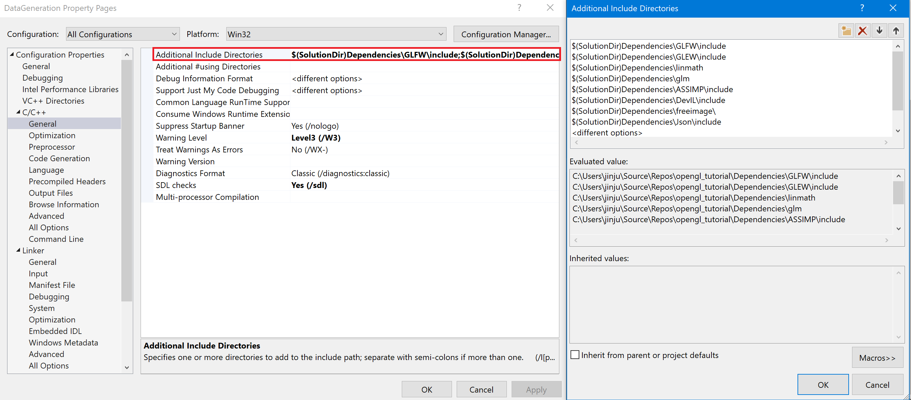
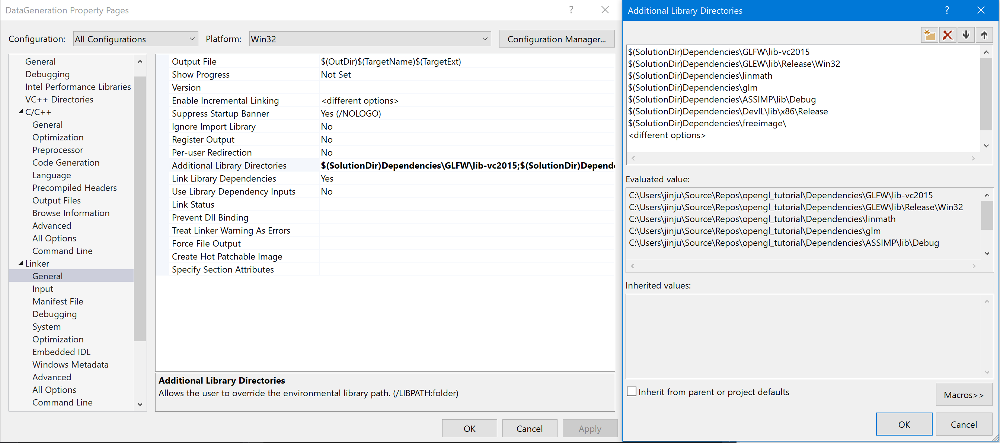

# 6D Data Generation Tool

## Setup Environemnt
1. Install Gitlab extensions in visual studio.
2. View->Team Explorer.
3. git clone this repo.
4. change Debug to x86.
5. project settings: <br />
	1. Include folder list:
	
	2. Linker setting:
    
	3. Library:
    
6. copy following library to directory
	Dependencies/ASSIMP/lib/
	Dependencies/DevIL/lib/
	Dependencies/GLEW/lib/
	Dependencies/GLFW/lib/
7. copy dll to Project/Debug/ folder<br />
	assimp-vc-140-mt.dll<br />
	DevIL.dll<br />
	FreeImg.dll<br />
	ILU.dll<br />
	ILUT.dll<br />
8. copy mesh folder to project root


## Camera Coordinate System
    see in image plane:
    x -> right
    y -> up
    z -> out of image plane

## Data Generation for Detection and Segmentation Comparison
file name: Experiment1_dection_or_segmentation.cpp
1. generated image size: 960x720
2. image data with whole randomization
3. mask data with occlusion (* full mask data **not** generated)
4. label data, json format: <br />
    BoundingBox : [xmin, y_min, x_max, y_max]  ratio of image width and height<br />
    Orientation : transpose([R|T])
    Quaternion : [x, y, z, w]
    center_point : [u_ratio, v_ratio, z_coordinate = -depth]
```
{"BoundingBox": [0.3763822317123413,0.3385462760925293,0.5609235763549805,0.7096770405769348],
 "Orientation": [[-0.13732697069644928, -0.7196202874183655, -0.6806525588035583,0.0],
                 [-0.09653744846582413, -0.674168050289154,  0.7322417497634888,0.0],
                 [-0.9858102202415466,  0.16626499593257904, 0.023111144080758095,0.0],
                 [-0.017308594658970833,-0.011850813403725624,-0.3442796468734741,1.0]],
 "Quaternion":   [-0.6151686310768127,0.3316804766654968,0.6772381663322449,0.23000875115394592],
 "center_point": [0.4654202163219452,0.5313478708267212,-0.3442796468734741],
 "name":30004,
 "object_id":"_05.stl"}

```

## Experiment Configurations:
    1. no random
    not really no random, basic randomization with background, position and pose
    
    
```c++
#define ENABLE_RANDOM_LIGHT_SOURCE_POSITION false
#define ENABLE_FOREGROUND_OBJECT false
#define SINGLE_LIGHT true

int light_num = 1;
glm::vec3 light_fix_position = glm::vec3(0.4, 0.4, 0.4);
std::vector<float> light_number_range = { 1.0f, 5.0f };						    //minimum>=2	maximum
std::vector<float> light_position_step = { 2000, 0.5 };						    //step_number, step_size, x,y,z min=-step_size and max=step_size
std::vector<float> point_light_ambient_color = { 0.1f,0.1f,0.1f,0.04f };     //{ 0.08f,0.08f,0.08f,0.4f };	// r mean, g mean, b mean, sigma  last change step, 0.1,0.2...
std::vector<float> point_light_diffuse_color = { 0.8f,0.8f,0.8f,0.01f };	    //
std::vector<float> point_light_specular_color = { 1.0f,1.0f,1.0f,0.01f };
//std::vector<float> point_light_position = { 1.0f , 1.0f, 5.0f };			    //start position, step size, end position (meter)
std::vector<float> direction_light_direction = { -0.2f,-1.0f,-0.3f, 0.5f };     //
std::vector<float> direction_light_ambient = { 0.15f,0.15f,0.15f,0.01f };
std::vector<float> direction_light_diffuse = { 0.4f,0.4f,0.4f,0.01f };
std::vector<float> direction_light_specular = { 0.5f,0.5,0.5f,0.01f };
//2. object material	
//std::vector<float> train_color = { 0.5f,0.5f, 0.5f, 0.01f };
std::vector<float> train_ambient = { 0.2,0.2,0.2, 0.01 };                      //{ 0.1f,0.1f, 0.1, 0.01f };
std::vector<float> train_diffuse = { 0.55f,0.55f, 0.55,0.01f };
std::vector<float> train_specular = { 0.2f,0.2f, 0.2f, 0.01f };
std::vector<float> train_shininess = { 0.1f, 16.0f };						       //minimum, maximum
std::vector<float> distractor_color = { 0.5f,0.5f, 0.5f,0.8f };
std::vector<float> distractor_ambient = { 0.5f,0.5f, 0.5f,0.3f };
std::vector<float> distractor_diffuse = { 0.5f,0.5f, 0.5f,0.3f };
std::vector<float> distractor_specular = { 0.1f,0.1f, 0.1f,0.3f };
std::vector<float> distractor_shininess = { 0.1f, 16.0f };
//3.object position
std::vector<float> object_position_distribution = { 0, 0.2, 0.02, 0.07};	      //xy_mean, z_mean, xy_sigma, z_sigma
std::vector<float> obstacles_scale_factor = { 0.2, 0.5 };						   //minimum maximum
std::vector<float> obstacles_scale_factor2 = {60.f, 80.f};

std::vector<float> cube_position = { 0.f, 3.14f, 0.0, 0.4, 0.01, 0.1 };		   //angle min,max, traslation xy_mean, z_mean, xy_sigma, z_sigma	
std::vector<float> cone_position = { 0.f, 7.f, 0.0, 0.4, 0.01, 0.1 };
std::vector<float> sphere_position = { 0.f, 3.65f, 0.0, 0.4, 0.01, 0.1 };
std::vector<float> donas_position = { 0.f, 2.48f, 0.0, 0.4, 0.01, 0.1 };
```
      