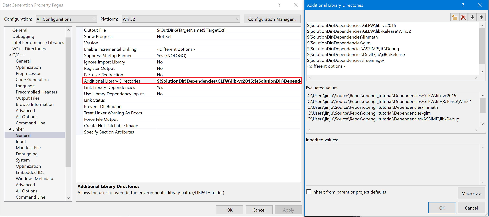

# 6D Data Generation Tool

## Setup Environemnt
1. Install Gitlab extensions in visual studio.
2. View->Team Explorer.
3. git clone this repo.
4. change Debug to x86.
5. project settings: <br />
	1. Include folder list:
	
	2. Linker setting:
    
	3. Library:
    
6. copy following library to directory
	Dependencies/ASSIMP/lib/
	Dependencies/DevIL/lib/
	Dependencies/GLEW/lib/
	Dependencies/GLFW/lib/
7. copy dll to Project/Debug/ folder<br />
	assimp-vc-140-mt.dll<br />
	DevIL.dll<br />
	FreeImg.dll<br />
	ILU.dll<br />
	ILUT.dll<br />
8. copy mesh folder to project root


## Camera Coordinate System
    see in image plane:
    x -> right
    y -> up
    z -> out of image plane

## Data Generation for Detection and Segmentation Comparison
1. generated image size: 960x720
2. image data with whole randomization
3. mask data with occlusion (* full mask data **not** generated)
4. label data, json format: <br />
    BoundingBox : [xmin, y_min, x_max, y_max]  ratio of image width and height<br />
    Orientation : transpose([R|T])
    Quaternion : [x, y, z, w]
    center_point : [u_ratio, v_ratio, z_coordinate = -depth]
```
{"BoundingBox": [0.3763822317123413,0.3385462760925293,0.5609235763549805,0.7096770405769348],
 "Orientation": [[-0.13732697069644928, -0.7196202874183655, -0.6806525588035583,0.0],
                 [-0.09653744846582413, -0.674168050289154,  0.7322417497634888,0.0],
                 [-0.9858102202415466,  0.16626499593257904, 0.023111144080758095,0.0],
                 [-0.017308594658970833,-0.011850813403725624,-0.3442796468734741,1.0]],
 "Quaternion":   [-0.6151686310768127,0.3316804766654968,0.6772381663322449,0.23000875115394592],
 "center_point": [0.4654202163219452,0.5313478708267212,-0.3442796468734741],
 "name":30004,
 "object_id":"_05.stl"}

```

      