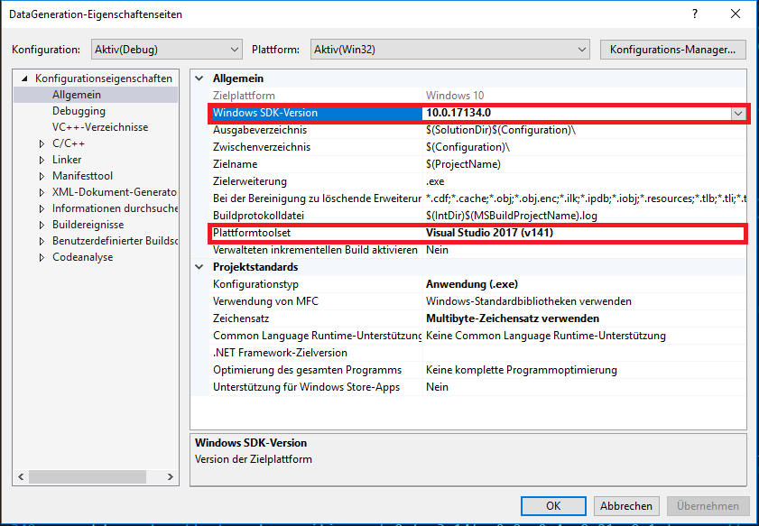

# 6D Data Generation Tool

## Setup Environemnt
1. Install Gitlab extensions in visual studio.
2. View->Team Explorer.
3. git clone this repo.
4. change Debug to x86.
5. project settings: <br />
    1. Adjust general project setting according to your windows SDK and plattform version: <br />
	 <br />
    2. c++ standard setting: <br />
	 <br />    
	3. Include folder list: <br />
	 <br />
	4. Linker setting: <br />
     <br />
	5. Library: <br />
     <br />
6(optional). copy following library to directory if the lib file is not there<br />
	Dependencies/ASSIMP/lib/<br />
	Dependencies/DevIL/lib/<br />
	Dependencies/GLEW/lib/<br />
	Dependencies/GLFW/lib/<br />
7. copy dll to "Project/Debug/" folder, you can find these dlls in folder "./dll/" <br />
	assimp-vc-140-mt.dll<br />
	DevIL.dll<br />
	FreeImg.dll<br />
	ILU.dll<br />
	ILUT.dll<br />
8. copy mesh folder to project root


## Camera Coordinate System
    see in image plane:
    x -> right
    y -> up
    z -> out of image plane

## Semantic Segmentation Data Generation
Headless rendering is <b>not</b> supported and please keep your rendering <b>window</b> open on your desktop layout.
Modify following code in the file: <b>Datagenerator_FCN8.cpp</b> to change configurations:<br />
<b>0.</b> Please create your output data folder structure as follows, for convienience, you can just copy the folder "./structure/" to the place you want:
generated_data
|->converted
  |->full_mask_
  |->gt_one_hot
  |->gt_one_hot_full_mask
  |->image
  |->mask
|->full_mask
|->gt_one_hot
|->label
|->mask_data
|->pose_estimation
|->training_data
|->config_
<b>1.</b> Change the path to the model you want to render, and the background images you want to use<br />
```cpp
#define LOAD_MODEL "mesh/obj_05.stl"  //model to render
#define BACK_GROUND_IMAGE_PATH "C:\\Users\\uteln\\Pictures\\JPEGImages" //background images
```
<b>2.</b> Setup your output folder path as follows, don't forget the <b>file extensions</b>:<br />
```cpp
#define JSON_LABEL "C:/Users/uteln/Pictures/EXP/generated_data/label/.json"
#define SAVE_IMAGE_PATH "C:/Users/uteln/Pictures/EXP/generated_data/training_data/.jpg"  
#define MASK_DATA_PATH "C:/Users/uteln/Pictures/EXP/generated_data/mask_data/.jpg"
#define FULL_MASK "C:/Users/uteln/Pictures/EXP/generated_data/full_mask/.jpg"
```
<b>3.</b> Enable backgrounds and image size. Change if you need otherwise leave it as it is:<br />
```cpp
#define ENABLE_RANDOM_LIGHT_SOURCE_POSITION true
#define ENABLE_FOREGROUND_OBJECT true
#define SINGLE_LIGHT false
#define USE_COLOR_BACKGROUND false
bool USE_BACKGROUND_IMAGE = true;   //use the random background you select
const unsigned int SCR_WIDTH = 960;  //generated image size
const unsigned int SCR_HEIGHT = 720;
```
<b>4.</b> rendering settings: chage scaling factor, if the mesh file is in mm, convert it to m. Set the data number you want.
```cpp
float scale_factor = 0.001; //convert mm to m
int generat_data_number = 4000; // how many data to generate
//******************************************************//
//***you may not need to change the following params****//
//**these parameter value are teseted with experiments**//
//*****modify when you want do your own exoeriments*****//

int light_num = 1;//used when single light model is on
glm::vec3 light_fix_position = glm::vec3(0.4, 0.4, 0.4);
std::vector<float> light_number_range = { 1.0f, 10.0f };					//minimum	maximum
std::vector<float> light_position_step = { 1, 2, 3 };						//step_number, step_size, x,y,z min=-step_size and max=step_size
std::vector<float> point_light_ambient_color = { 0.08f,0.08f,0.08f,0.4f };  //r mean, g mean, b mean, standard deviation
std::vector<float> point_light_diffuse_color = { 0.8f,0.8f,0.8f,0.05 };	   //r mean, g mean, b mean, standard deviation
std::vector<float> point_light_specular_color = { 1.0f,1.0f,1.0f,0.1 };     //r mean, g mean, b mean, standard deviation

std::vector<float> direction_light_direction = { -0.2f,-1.0f,-0.3f, 0.1 }; //x mean, y mean, z mean, standard deviation(uniform distribution is beeter)
std::vector<float> direction_light_ambient = { 0.15f,0.15f,0.15f, 0.2};    //r mean, g mean, b mean, standard deviation
std::vector<float> direction_light_diffuse = { 0.4f,0.4f,0.4f, 0.05 };     //r mean, g mean, b mean, standard deviation
std::vector<float> direction_light_specular = { 0.5f,0.5,0.5f, 0.1 };      //r mean, g mean, b mean, standard deviation
//2. object material	
//std::vector<float> train_color = { 0.5f,0.5f, 0.5f, 0.01f };             //r mean, g mean, b mean, standard deviation
std::vector<float> train_ambient = { 0.1,0.1,0.1, 0.05 };		             //r mean, g mean, b mean, standard deviation
std::vector<float> train_diffuse = { 0.55f,0.55f, 0.55,0.05 };             //r mean, g mean, b mean, standard deviation
std::vector<float> train_specular = { 0.2f,0.2f, 0.2f, 0.05 };             //r mean, g mean, b mean, standard deviation
std::vector<float> train_shininess = { 20.f, 10*0.05 };					  //mean, standard deviation
std::vector<float> distractor_color = { 0.1f,0.1f, 0.1f,0.05 };            //r mean, g mean, b mean, standard deviation
std::vector<float> distractor_ambient = { 0.5f,0.5f, 0.5f,0.05 };          //r mean, g mean, b mean, standard deviation
std::vector<float> distractor_diffuse = { 0.5f,0.5f, 0.5f,0.05 };          //r mean, g mean, b mean, standard deviation
std::vector<float> distractor_specular = { 0.1f,0.1f, 0.1f,0.05 };         //r mean, g mean, b mean, standard deviation
std::vector<float> distractor_shininess = { 32.f, 10 * 0.05 };             //mean standard deviation
//3.object position
std::vector<float> object_position_distribution = { 0, 0.1, 0.02, 0.05};	//xy_mean, z_mean, xy_sigma, z_sigma
std::vector<float> obstacles_scale_factor = { 0.2, 0.5 };				    //minimum maximum
std::vector<float> obstacles_scale_factor2 = {60.f, 80.f};                //minimum maximum

std::vector<float> cube_position = { 0.f, 3.14f, 0.0, 0.4, 0.01, 0.1 };		//angle min,max, traslation xy_mean, z_mean, xy_sigma, z_sigma	
std::vector<float> cone_position = { 0.f, 7.f, 0.0, 0.4, 0.01, 0.1 };        //angle min,max, traslation xy_mean, z_mean, xy_sigma, z_sigma	
std::vector<float> sphere_position = { 0.f, 3.65f, 0.0, 0.4, 0.01, 0.1 };    //angle min,max, traslation xy_mean, z_mean, xy_sigma, z_sigma	
std::vector<float> donas_position = { 0.f, 2.48f, 0.0, 0.4, 0.01, 0.1 };     //angle min,max, traslation xy_mean, z_mean, xy_sigma, z_sigma	

//******************************************************//
```

<b>5.</b> Hit <b>F5</b> start rendering.<br />
RGB data
 <br />
Mask data    
 <br />
Generated data in general
 <br />

<b>6.<b/> label data, json format: <br />
    BoundingBox : [xmin, y_min, x_max, y_max]  ratio of image width and height<br />
    Orientation : transpose([R|T])
    Quaternion : [x, y, z, w]
    center_point : [u_ratio, v_ratio, z_coordinate = -depth]
```
{"BoundingBox": [0.3763822317123413,0.3385462760925293,0.5609235763549805,0.7096770405769348],
 "Orientation": [[-0.13732697069644928, -0.7196202874183655, -0.6806525588035583,0.0],
                 [-0.09653744846582413, -0.674168050289154,  0.7322417497634888,0.0],
                 [-0.9858102202415466,  0.16626499593257904, 0.023111144080758095,0.0],
                 [-0.017308594658970833,-0.011850813403725624,-0.3442796468734741,1.0]],
 "Quaternion":   [-0.6151686310768127,0.3316804766654968,0.6772381663322449,0.23000875115394592],
 "center_point": [0.4654202163219452,0.5313478708267212,-0.3442796468734741],
 "name":30004,
 "object_id":"_05.stl"}

```